# 跨平台开发

---

- 移动应用迭代周期越来越短
- App Store审核周期长，Google Store
- 需要快速发布，及时修复更新
- 初创产品同时招募多个平台的开发人员，成本太高

---

- 在APP中使用WebView加载本地或服务器上的资源文件
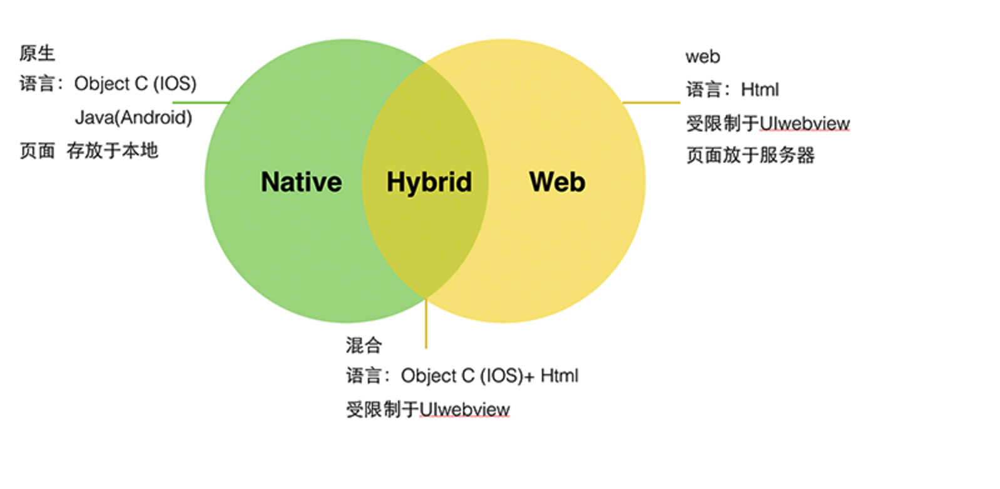
- Cordova(Ionic)
- 运行效率较低，但开发方便

---

### React Native
- 基于ReactJs，技术成熟
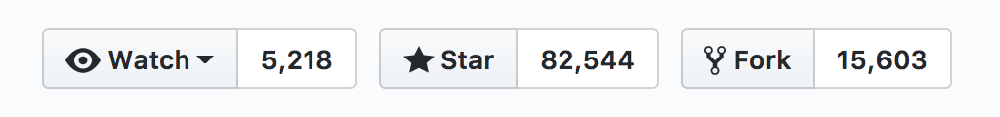

- 前端社区繁荣，工具链完整

- facebook支持，社区活跃
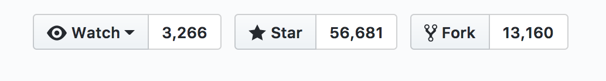

---

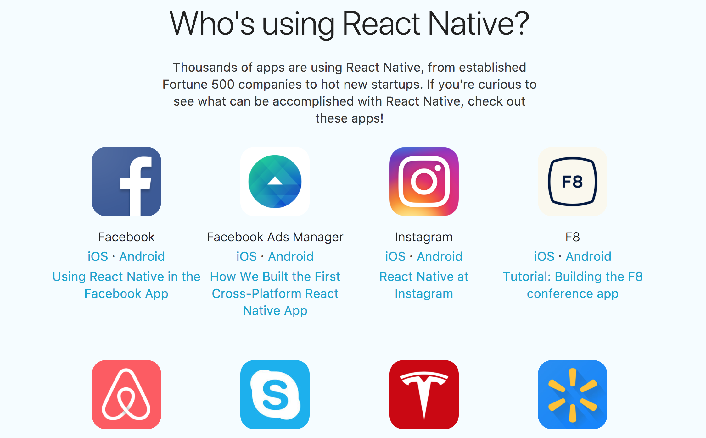

---

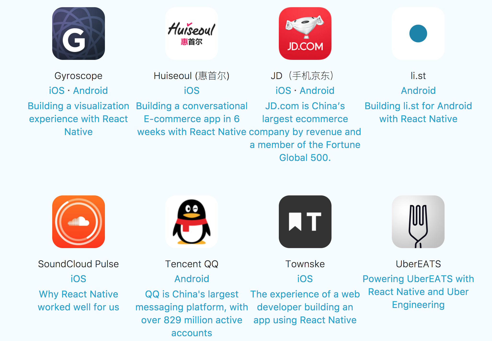

---

- Learn once, Write anywhere!
- JavaScript只是将应用的“配置信息和业务逻辑”，告诉原生代码该如何去渲染页面，效率高
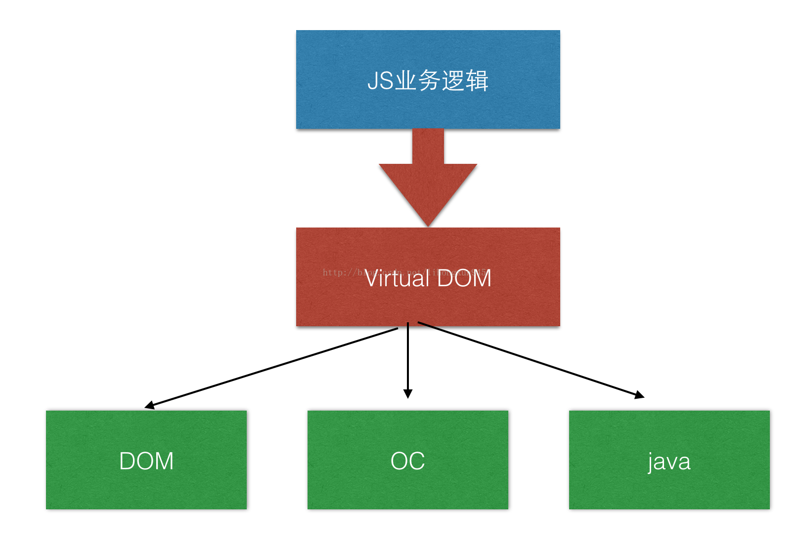]<!-- .element height="90%" width="90%" -->

---

### [ReactJs](https://reactjs.org/)
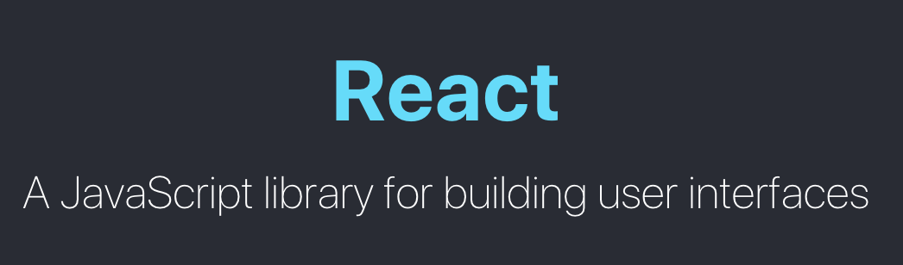
- [简易教程](https://github.com/lxs137/react_tutorial) 
- 轻量：MVC中的View层框架
- 高效：构建虚拟DOM，通过DOM Diff算法，尽可能少的更新界面
- 方便的JSX语法，便于记忆，较为灵活

---

### JS与原生平台交互
- <small>OC端和JS端各有一个bridge，保存了模块配置表</small> 
- <small>JS不会主动调用OC，当会改变页面状态的事件发生时，OC都会调用JS相应的模块方法去处理</small>
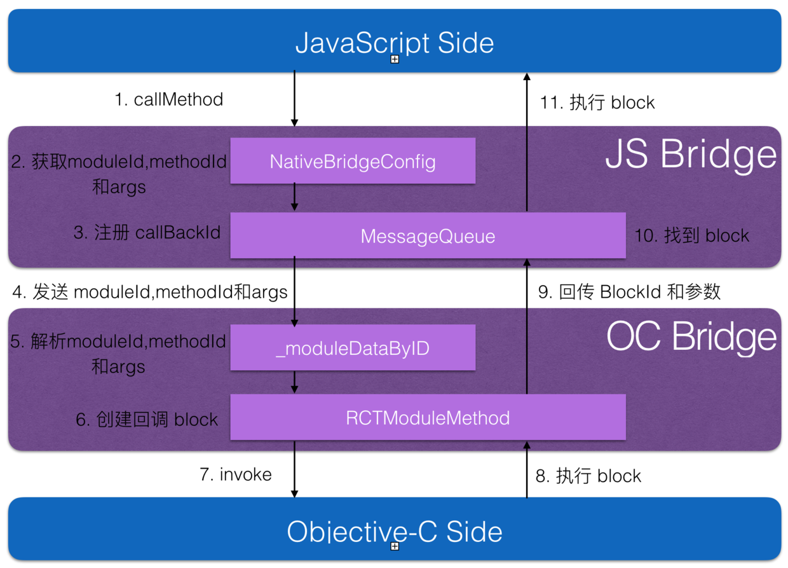<!-- .element height="70%" width="70%" -->

---

### TodoList APP
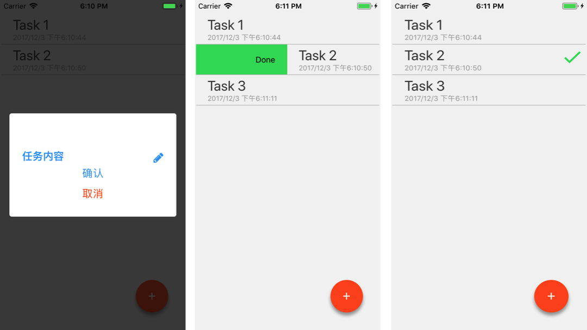

---

### [环境搭建](https://facebook.github.io/react-native/docs/getting-started.html)
- NodeJs + npm, watchman
```bash
brew install node
brew install watchman
```
- react-native cli
```bash
npm install -g react-native-cli
```

---

#### 初始化项目

```bash
# 自动搭建出项目基本骨架
react-native init TodoReactNative
# npm install -g create-react-native-app
# create-react-native-app TodoReactNative
```
#### 运行

```bash
cd TodoReactNative
# IOS Debug
react-native run-ios
# Android Debug
react-native run-android
```

---

#### 项目结构
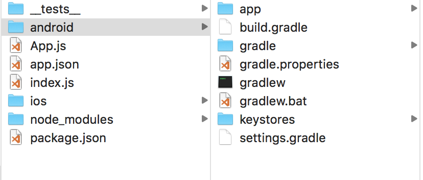<!-- .element height="60%" width="60%" -->
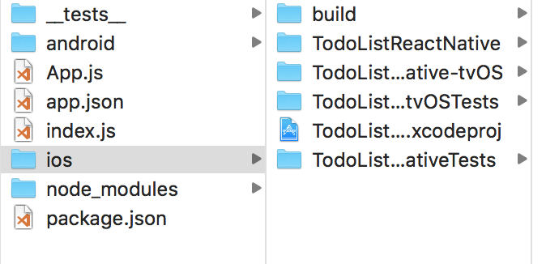<!-- .element height="60%" width="60%" -->

---

#### 开发演示
- npm安装第三方UI库

```bash
npm install --save react-native-vector-icons 
npm install --save react-native-action-button 
npm install --save react-native-modal 
npm install --save react-native-swipeable 
npm install --save react-native-textinput-effects
```

---

### 打包
- [Running on devices](https://facebook.github.io/react-native/docs/running-on-device.html)

```bash
# Android Package
react-native bundle --platform android --dev false --entry-file index.js --bundle-output android/app/src/main/assets/index.android.bundle --assets-dest android/app/src/main/res
cd gradle && ./gradlew assembleRelease
# generate APK in android/app/build/outputs/apk 
```

---

## The End