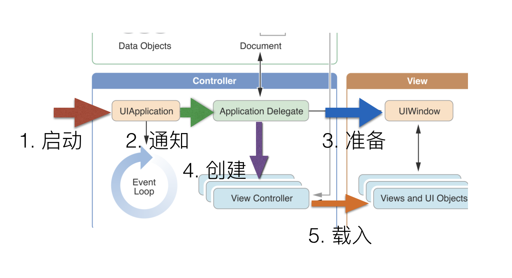
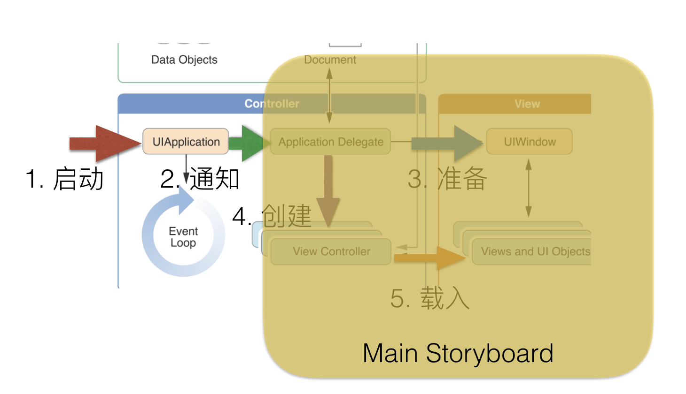

# iOS应用架构

---

## iOS 应用

- 应用（Apps）是你所开发的代码和系统框架间交互过程的实现
- 系统框架提供应用运行所需的所有基础设施
- 你所写的代码提供了对基础设施个性化定制，实现了你所需要的用户交互界面和业务功能


---

## 应用总体架构

 <!-- .element height="80%" width="80%" -->

Model-View-Controller

---

## 更细节


 <!-- .element height="50%" width="50%" -->

---

## UIApplication


- UIApplication 对象管理事件循环和高层的应用行为 
- 它将应用的关键性状态变化和一些特定事件（例如收到一个推送的通知）报告给你所定义的“委托”对象（delegate）
- UIApplication任何时候都不应该被改变

---

## 主循环

 <!-- .element height="50%" width="50%" -->

- 应用的主循环负责处理所有用户相关的事件 
- UIApplication对象负责在应用启动时为其创建主循环并以此处理事件
- 主循环在应用主线程中执行，以确保用户相关事件严格按其发生先后的顺序得到处理

---

## 应用委托（Delegate）

- 应用委托是应用的核心
- 该对象与UIApplication对象联合起来负责对应用的初始化过程、状态迁移过程和很多高层的应用事件进行处理
- 委托对象也是唯一一个每个应用都必须具有的对象，因此它一般还负责应用所需数据结构的初始化

---

## 委托（Delegation）

 <!-- .element height="80%" width="80%" -->


---


## AppDelegate

```swift
import UIKit

@UIApplicationMain
class AppDelegate: UIResponder, UIApplicationDelegate {

    var window: UIWindow?

    func application(_ application: UIApplication, didFinishLaunchingWithOptions launchOptions: [UIApplicationLaunchOptionsKey: Any]?) -> Bool {
        // Override point for customization after application launch.
        return true
    }

    func applicationWillResignActive(_ application: UIApplication) {
        // Sent when the application is about to move from active to inactive state. This can occur for certain types of temporary interruptions (such as an incoming phone call or SMS message) or when the user quits the application and it begins the transition to the background state.
        // Use this method to pause ongoing tasks, disable timers, and invalidate graphics rendering callbacks. Games should use this method to pause the game.
    }

    func applicationDidEnterBackground(_ application: UIApplication) {
        // Use this method to release shared resources, save user data, invalidate timers, and store enough application state information to restore your application to its current state in case it is terminated later.
        // If your application supports background execution, this method is called instead of applicationWillTerminate: when the user quits.
    }

    func applicationWillEnterForeground(_ application: UIApplication) {
        // Called as part of the transition from the background to the active state; here you can undo many of the changes made on entering the background.
    }

    func applicationDidBecomeActive(_ application: UIApplication) {
        // Restart any tasks that were paused (or not yet started) while the application was inactive. If the application was previously in the background, optionally refresh the user interface.
    }

    func applicationWillTerminate(_ application: UIApplication) {
        // Called when the application is about to terminate. Save data if appropriate. See also applicationDidEnterBackground:.
    }
}
```

---

## UIWindow

- `UIWindow`对象代表应用在屏幕上的现实窗口，负责协调视图在设备屏幕上的现实 
- 一般而言每个应用拥有一个窗口并将窗口内的内容显示在设备主屏幕上，如果存在外部现实设备，应用也可以具有额外的窗口
- 除了用以显示内容外，窗口也负责协助`UIApplication`对象将系统事件传递到视图和视图控制器以便处理

---

## 视图

- 视图（View）是在一个特定矩形区域内可视内容，并可以响应在该区域内的用户交互事件
  - 控件（Control）是特定类型的视图，例如按钮、输入框、开关等
- `UIKit`框架提供了很多标准的视图组件用以显示不同类型的内容，也可以通过继承`UIView`对象定制自己所需的视图

---


## 视图控制器

- 视图控制器（View Controller）对象管理应用视图在屏幕上的显示 
- 所有的视图控制器都是继承自`UIViewController` 
- 负责处理用户界面（视图）的加载、显示、旋转等系统行为 
- 在UIKit和其他框架中也定义了很多额外的视图控制器用以实现一些标准的系统界面的管理，例如图片选取、导航和标签栏等

---


## 文档和数据模型

- 数据模型对象被用以保存应用需要维护和管理的内容，例如 
  + 银行应用需要数据库存储相关的金融交易事务
  + 画图应用需要保存用户所画的图像

---


## 运行过程



---

## App入口

```swift
import UIKit

@UIApplicationMain
class AppDelegate: UIResponder, UIApplicationDelegate {

    var window: UIWindow?

    func application(_ application: UIApplication, didFinishLaunchingWithOptions launchOptions: [UIApplicationLaunchOptionsKey: Any]?) -> Bool {
        // Override point for customization after application launch.
        return true
    }

    ...
}
```

---

## StoryBoard




---

## 应用终止

- 应用必须随时准备被终止
  * 系统需要为用户启动的其他应用分配内存
  * 应用存在不良行为或未能及时响应
- 一旦收到系统发出的终止通知，应用需要及时终止当前操作并保存需要保存的数据

--- 


## 应用执行状态（生命周期）

<!-- .element height="50%" width="50%" -->


---

## 实践验证

```swift
import UIKit

@UIApplicationMain
class AppDelegate: UIResponder, UIApplicationDelegate {

    var window: UIWindow?


    func application(_ application: UIApplication, didFinishLaunchingWithOptions launchOptions: [UIApplicationLaunchOptionsKey: Any]?) -> Bool {
        // Override point for customization after application launch.
        print("didFinishLaunchingWithOptions")
        return true
    }

    func applicationWillResignActive(_ application: UIApplication) {
        // Sent when the application is about to move from active to inactive state. This can occur for certain types of temporary interruptions (such as an incoming phone call or SMS message) or when the user quits the application and it begins the transition to the background state.
        // Use this method to pause ongoing tasks, disable timers, and invalidate graphics rendering callbacks. Games should use this method to pause the game.
        print("applicationWillResignActive")
    }

    func applicationDidEnterBackground(_ application: UIApplication) {
        // Use this method to release shared resources, save user data, invalidate timers, and store enough application state information to restore your application to its current state in case it is terminated later.
        // If your application supports background execution, this method is called instead of applicationWillTerminate: when the user quits.
        print("applicationDidEnterBackground")
    }

    func applicationWillEnterForeground(_ application: UIApplication) {
        // Called as part of the transition from the background to the active state; here you can undo many of the changes made on entering the background.
        print("applicationWillEnterForeground")
    }

    func applicationDidBecomeActive(_ application: UIApplication) {
        // Restart any tasks that were paused (or not yet started) while the application was inactive. If the application was previously in the background, optionally refresh the user interface.
        print("applicationDidBecomeActive")
    }

    func applicationWillTerminate(_ application: UIApplication) {
        // Called when the application is about to terminate. Save data if appropriate. See also applicationDidEnterBackground:.
        print("applicationWillTerminate")
    }


}
```

---

## 线程和并发

- 系统为应用运行创建一个线程（主线程），应用也可以创建额外线程已运行其他任务
  + 视图、动画等相关操作必须在主线程运行（线程安全性）
  + 图片操作、网络通信、文件存取、大量数据处理等操作必须用GCD或Operation对象方式实现并行
  + 应用启动时，主线程内计算和操作应尽量减少，以便应用能更快速地准备好用户界面


---

## 参考文档


[App Programming Guide for iOS](https://developer.apple.com/library/content/documentation/iPhone/Conceptual/iPhoneOSProgrammingGuide/)


---

## Caculator


---

## The End